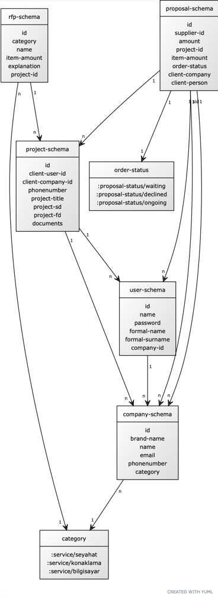

# POMS Demo project CONFIG
```
(alter-var-root #'datomic-client (constantly (datomic.client.api/client {:server-type :dev-local
:storage-dir "ADD YOUR ABSOLUTE DATABASE PATH HERE" 
;CONTENT/REPO DATABASE PATH: poms-db/ci/poms-db 
:system "ci"})))
```

# POMS Demo project

```
$ clj -A:dev -X user/main

Starting Electric compiler and server...
shadow-cljs - server version: 2.20.1 running at http://localhost:9630
shadow-cljs - nREPL server started on port 9001
[:app] Configuring build.
[:app] Compiling ...
[:app] Build completed. (224 files, 0 compiled, 0 warnings, 1.93s)

👉 App server available at http://0.0.0.0:8080
```

# POMS Demo Project Usecase

1.
    1. Satın alma uzmanı, kullanıcı adı ve şifresiyle sisteme giriş yapar.
    2. Sistem, bilgileri doğrular ve profili sunar.
    3. Satın alma uzmanı, "proje oluştur" ekranına yönlendirlir.
    4. Sistem, proje hakkında girilmesi gereken "genel bilgiler" ekranını sunar.
    5. Satın alma uzmanı istenen bilgileri doldurur ve create butonuna tıklar:

- Username:
- Contact Number:
- Project Title:
- Start Date:
- Finish Date:
- Documents:

    6. Sistem, genel bilgileri veri tabanına kaydeder ve sonraki aşamaya kullanıcı yönlendirir.
    7. Sistem kullanıcıdan aktif bir proje için RFP olusturma ekranını sunar ve gerekli bilgilerin doldurulmasını
       ister.

- category:
- Rfp Title:
- Item Amount:
- Explanation:
- Releated Project Id:

    8. Sistem, sipariş(RFP) bilgilerini veri tabanına kaydeder, sonraki aşamaya (tedarikçi bilgileri formu)
       geçer ve kayıtlı tüm tedarikçileri isme göre sıralar. (A’dan Z’ye doğru)
    9. Satın alma uzmanı, fiyat isteyeceği tedarikçilerin kayıtlı tedarikçiler listesinde olup olmadığını kontrol eder.
    10. Satın alma uzmanının çalışmak istediği bir tedarikçi kayıtlı tedarikçi listesinde bulunmamaktadır bu nedenle
        isteme yeni tedarikçi eklemek ister ve Tedarikçi ekle butonuna tıklar.
    11. Sistem, yeni bir tablo sunar ve satın alma uzmanı bilgileri girer, sistem yeni tedarikçiyi veritabanına kaydeder
    12. Sistem, bilgileri girilen tedarikçileri veri tabanına kaydeder ve uzmana "supplier information screen"
        ekranında gösterir kullanıcı devamında proje önizleme butonuna basar.
    13. Satın alma uzmanı, ön izleme ekranında gösterilen bilgileri kontrol eder ve "proje başlat" talimatını verir.
    14. Sistem, tedarikçileri "teklif giriş ekranına" yönlendirir ve tedarikçiler, "teklif gir" talimatını verir,
        tekliflerini girerler.
    15. Sistem, tedarikçilerin girdiği teklifleri veri tabanına kaydeder, satın alma uzmanına bildirim
        gönderir.
    17. Satın alma uzmanı, sistem "Approve Proposal" ekranında tedarikçilerin
        tekliflerini en iyi tekliften en kötü teklife doğru gösterir.
    18. Satın alma uzmanı, "Approve Proposal" ekranında uygun bulduğu tedarikçileri onaylar, sistem
        tedarikçilere bildirim gönderir ve proje sonlanır.
    19. Sistem, tüm paydaşlara tedarikçilerin hazırladığı siparişlerin durumlarını takip etmesi için
        "sipariş ekranı" sunar ve bildirim gönderir. Gerçekleşen her bir güncelleme, siparişler teslim
        edilene kadar ekranda gösterilir.

# DB Schema Diagram (YUML)




